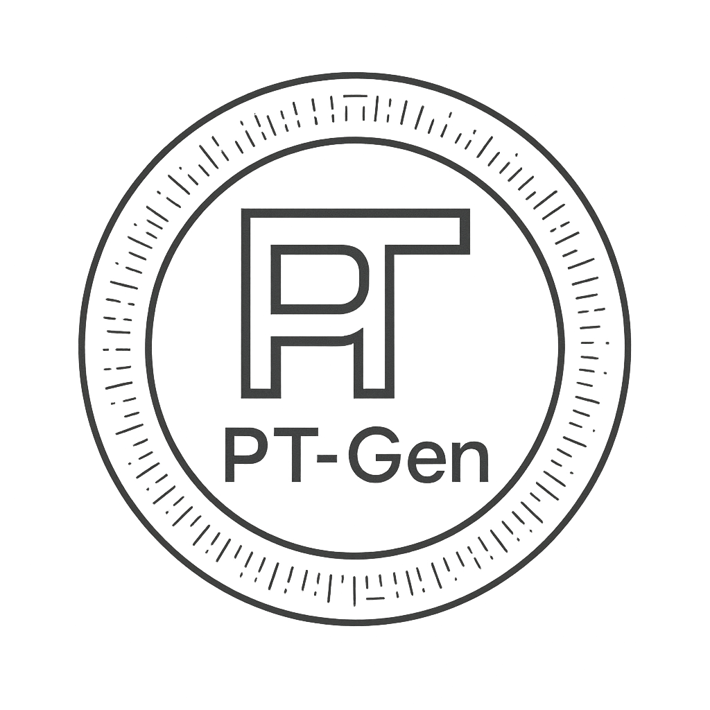

<p align="center">
  
</p>

<p align="center">
  
  
  
</p>

## 关于PT-Gen-Refactor

这是一个基于 Cloudflare Worker 和 React 的应用程序，用于生成 PT (Private Tracker) 资源描述。支持从多个平台（如豆瓣、IMDb、TMDB、Bangumi、Melon、Steam等）获取媒体信息，并生成标准的 PT 描述格式。

## 重要提醒

豆瓣近期更新的反爬机制,增加了挑战算法,经测试如不登录使用Cookie是无法获取信息,但是如使用Cookie不知道会不会封禁账号,请各位自行斟酌!

## 支持的平台

| 平台 | 类型 | 需要API密钥 | 备注 |
|------|------|------------|------|
| 豆瓣 (Douban) | 电影、电视剧、读书 | 否 | 可选Cookie以获取更多信息 |
| IMDb | 电影、电视剧 | 否 | - |
| TMDB | 电影、电视剧 | 是 | 需要在环境变量中配置API密钥 |
| Bangumi | 动画 | 否 | - |
| Melon | 音乐 | 否 | 韩国音乐平台 |
| Steam | 游戏 | 否 | - |
| 红果短剧 (HongGuo) | 短剧 | 否 | 支持WEB端和APP的链接 |
| QQ 音乐 | 音乐 | 否 | 支持QQ音乐WEB的专辑链接(必须提供Cookie) |

## DEMO预览

<a href="https://pt-gen.hares.dpdns.org" target="_blank">
  
</a>

## 一键部署到 Cloudflare Workers（推荐）

[](https://deploy.workers.cloudflare.com/?url=https://github.com/xwell/PT-Gen-Refactor)

点击上方 **Deploy to Cloudflare** 按钮，按照提示完成部署：

1. 授权 GitHub 仓库访问
2. 连接 Cloudflare 账号
3. 等待部署完成

部署完成后，你的服务将立即可用。

### 部署后配置（可选）

部署成功后，你可以通过 Cloudflare Dashboard 配置以下可选项：

**配置 Secrets（敏感信息）：**
在 Workers & Pages > 你的 Worker > Settings > Variables and Secrets 中添加：
- `TMDB_API_KEY` - TMDB API 密钥（使用中文搜索必需）
- `DOUBAN_COOKIE` - 豆瓣 Cookie（获取更多信息可选）
- `QQ_COOKIE` - QQ音乐 Cookie（使用QQ音乐功能必需）
- `API_KEY` - 安全 API 密钥（保护接口可选）

> **注意：** R2 存储桶 `pt-gen-cache` 会在一键部署时自动创建并绑定，无需手动配置。

**配置 D1 数据库（可选，替代 R2 缓存）：**
如需使用 D1 替代 R2 作为缓存存储：
1. 在 D1 页面创建数据库 `pt-gen-cache`
2. 执行建表 SQL（参考下方手动部署说明）
3. 在 Worker Settings 中绑定 D1 数据库

## 功能特性

- 支持从多个平台获取媒体信息：
  - 豆瓣 (Douban) - 电影、电视剧、读书
  - IMDb (Internet Movie Database)
  - TMDB (The Movie Database)
  - Bangumi (番组计划)
  - Melon (韩国音乐平台)
  - Steam (游戏平台)
  - 红果短剧 (短剧平台)
  - QQ 音乐 (中国音乐平台)
- 自动生成标准 PT 描述格式
- 响应式 React 前端界面
- 基于 Cloudflare Worker 的后端服务
- 支持多种媒体类型（电影、电视剧、音乐、游戏等）
- 智能搜索功能（根据关键词语言自动选择搜索平台）
- 请求频率限制和恶意请求防护
- 多种缓存存储（R2或D1数据库，避免重复抓取相同资源，提高响应速度）

## 环境要求

- Node.js (推荐版本 16+)
- npm 或 yarn

## 安装与设置

### 1. 克隆项目

```bash
git clone https://github.com/rabbitwit/PT-Gen-Refactor.git
cd PT-Gen-Refactor
```

### 2. 安装依赖

```bash
# 安装根目录依赖
npm install

# 安装 Worker 依赖
cd worker
npm install
cd ..

# 安装前端依赖 (如不需要前端界面，请忽略此步骤)
cd frontend
npm install
cd ..
```

## 开发环境

### 启动开发服务器

1. 启动 Cloudflare Worker:
   ```bash
   npm run dev
   ```
   默认运行在 http://localhost:8787

2. 启动 React 开发服务器:
   ```bash
   npm run dev:frontend
   ```
   默认运行在 http://localhost:5173

### 项目脚本

- `npm run dev` - 启动 Worker 开发服务器
- `npm run dev:frontend` - 启动前端开发服务器
- `npm run deploy` - 部署 Worker 到 Cloudflare
- `npm run install:all` - 一次性安装所有依赖

## 部署

### 1. 配置 Cloudflare

1. 注册或登录 [Cloudflare](https://www.cloudflare.com/) 账户
2. 获取 Cloudflare API Token（用于部署 Worker）
3. 安装 Wrangler CLI：
   ```bash
   npm install -g wrangler
   ```
4. 登录 Wrangler：
   ```bash
   npx wrangler login
   ```

### 2. 创建存储资源

本项目支持两种缓存存储方式：R2 对象存储和 D1 数据库。您可以选择其中一种或同时使用两种。

#### 方式一：创建 R2 存储桶

R2 是 Cloudflare 提供的对象存储服务，本项目使用 R2 来缓存已抓取的数据，避免重复请求相同的资源。

1. 登录 Cloudflare 控制台
2. 导航到 R2 页面
3. 创建一个新的存储桶，命名为 `pt-gen-cache`
4. 确保存储桶名称与 `wrangler.toml` 文件中配置的 `bucket_name` 一致

#### 方式二：创建 D1 数据库

D1 是 Cloudflare 提供的分布式数据库服务，您也可以使用 D1 作为缓存存储。

1. 登录 Cloudflare 控制台
2. 导航到 D1 页面
3. 创建一个新的数据库，命名为 `pt-gen-cache`
4. 获取数据库 ID 并在 `wrangler.toml` 文件中配置

##### 初始化 D1 数据库表

创建数据库后，您需要手动创建缓存表。有两种方式可以完成此操作：

**方法一：使用 Wrangler 命令行工具**

```bash
npx wrangler d1 execute pt-gen-cache --command "CREATE TABLE IF NOT EXISTS cache (key TEXT PRIMARY KEY, data TEXT NOT NULL, timestamp INTEGER NOT NULL);"
```

**方法二：通过 Cloudflare 控制台**

1. 登录 Cloudflare 控制台
2. 导航到 D1 页面
3. 选择您创建的 `pt-gen-cache` 数据库
4. 在 SQL 查询区域执行以下 SQL 语句：

```sql
CREATE TABLE IF NOT EXISTS cache (
  key TEXT PRIMARY KEY,
  data TEXT NOT NULL,
  timestamp INTEGER NOT NULL
);
```

### 3. 配置环境变量

编辑根目录下的 `wrangler.toml` 文件，更新以下配置：
```
name = "pt-gen-refactor"  # Worker 名称，可以修改为你自己的名称

# 静态资源绑定 (如不需要前端界面，请使用# 注释)
[assets]
directory = "./frontend/dist"
binding = "ASSETS"

[vars]
AUTHOR = "your_author"
# TMDB API密钥（如果需要使用TMDB功能）
TMDB_API_KEY = "your_tmdb_api_key"
# 豆瓣Cookie（可选，用于获取更多信息）
DOUBAN_COOKIE = "your_douban_cookie"
QQ_COOKIE = "your_qq_music_cookie"
# 安全API密钥（可选）
API_KEY = "your_api_key"
# 静态资源缓存配置,如设置为false则豆瓣、IMDB、Bangumi、Steam 优先从[PtGen Archive](https://github.com/ourbits/PtGen)获取数据，true则会优先从R2或D1获取数据
ENABLED_CACHE = "true"

# R2 存储桶配置（可选，选择一种缓存方式即可）[推荐]
[[r2_buckets]]
binding = "R2_BUCKET"
bucket_name = "pt-gen-cache"

# D1 数据库配置（可选，选择一种缓存方式即可）
[[d1_databases]]
binding = "DB"
database_name = "pt-gen-cache"
database_id = "your_database_id"
```

下表列出了所有可用的环境变量及其说明：

| 环境变量 | 是否必需 | 默认值 | 说明 |
|---------|---------|--------|------|
| `AUTHOR` | 否 | - | 作者信息，用于标识资源描述的生成者 |
| `TMDB_API_KEY` | 否* | - | TMDB API 密钥，如果需要使用 TMDB 功能则必需 |
| `DOUBAN_COOKIE` | 否 | - | 豆瓣 Cookie，用于获取更多豆瓣信息（可选） |
| `QQ_COOKIE` | 否* | - | QQ音乐 Cookie，用于使用获取QQ音乐信息如需要使用QQ音乐信息则必需 |
| `API_KEY` | 否 | - | 安全 API 密钥，用于保护 API 接口（可选） |
| `ENABLED_CACHE` | 否 | `true` | 是否启用缓存功能 |

> *注意：如果要使用中文搜索功能，必须配置 TMDB_API_KEY，否则只能使用英文进行搜索（调用 IMDb）。

### 4. 部署方式

#### 方式一：前后端一起部署到 Cloudflare Worker（推荐）

这种方式将前端静态文件和后端 API 都部署到同一个 Worker 中，避免跨域问题。

1. 构建前端应用：
   ```bash
   cd frontend
   npm run build
   cd ..
   ```

2. 部署到 Cloudflare Worker：
   ```bash
   npm run deploy
   ```
   
   或者直接使用 Wrangler 命令：
   ```bash
   cd worker
   npx wrangler deploy
   cd ..
   ```

部署成功后，会输出类似以下的信息：
```
Uploaded pt-gen-refactor (1.2 seconds)
Published pt-gen-refactor (0.3 seconds)
  https://pt-gen-refactor.your-subdomain.workers.dev
```

#### 方式二：只部署后端到 Cloudflare Worker

这种方式将后端 API 部署到 Cloudflare Worker。

1. 构建后端应用：
   ```bash
   cd worker
   npx wrangler deploy
   cd ..
   ```

部署成功后，会输出类似以下的信息：
```
Uploaded pt-gen-refactor (1.2 seconds)
Published pt-gen-refactor (0.3 seconds)
  https://pt-gen-refactor.your-subdomain.workers.dev
```

#### 方式三：使用预构建的 bundle.js 文件（无需本地构建环境）

对于没有 Node.js 构建环境的用户，可以使用我们预构建的 bundle.js 文件。这个文件通过 GitHub Actions 自动构建并推送到 `build` 分支。

1. 从 [build 分支](https://github.com/rabbitwit/PT-Gen-Refactor/tree/build) 下载 `bundle.js` 文件
2. 重命名为 `index.js`
3. 将该文件直接上传到 Cloudflare Worker 控制台，或直接复制代码到 Cloudflare Worker 控制台。
4. 在变量和机密的设置中添加所需的环境变量。

## API 接口

所有接口支持 POST 和 GET 请求方式。

### URL 参数方式（只部署后端）

直接解析特定平台的资源链接:
- `/?url=https://movie.douban.com/subject/123456/` - 解析豆瓣资源（包含演员/导演图片）
- `/?url=https://www.imdb.com/title/tt123456/` - 解析 IMDb 资源
- `/?url=https://www.themoviedb.org/movie/123456` - 解析 TMDB 资源

支持在路径中使用 API Key（无需在参数中拼接）：
- `/{apikey}/?url=https://movie.douban.com/subject/123456/`

### URL 参数方式（前后端一起部署）

后端 API 路径：
- `/api?url=https://movie.douban.com/subject/123456/` - 解析豆瓣资源（包含演员/导演图片）
- `/api?url=https://www.imdb.com/title/tt123456/` - 解析 IMDb 资源
- `/api?url=https://www.themoviedb.org/movie/123456` - 解析 TMDB 资源

支持在路径中使用 API Key：
- `/api/{apikey}/?url=https://movie.douban.com/subject/123456/`

### Params 参数方式

- `/api?source=douban&sid=123456` - 解析豆瓣资源（包含演员/导演图片）
- `/api?source=imdb&sid=tt123456` - 解析 IMDb 资源
- `/api?source=tmdb&sid=123456&type=movie` - 解析 TMDB 电影资源（使用 type 参数）
- `/api?source=tmdb&sid=123456&type=tv` - 解析 TMDB 电视剧资源（使用 type 参数）

支持在路径中使用 API Key：
- `/api/{apikey}/?source=tmdb&sid=123456&type=movie`

## 新增功能亮点

- **豆瓣信息增强**：豆瓣资源现在包含演员和导演的图片信息
- **更丰富的元数据**：提供更完整的媒体信息用于PT站点发布
- **性能优化**：改进了数据抓取和处理逻辑
- **多种缓存选择**：支持 R2 对象存储和 D1 数据库两种缓存方式，用户可根据需求选择
- **静态数据缓存**：新增对豆瓣、IMDb、Bangumi和Steam平台的静态数据缓存支持 [PtGen Archive](https://github.com/ourbits/PtGen)


### getStaticMediaDataFromOurBits

该函数用于从OurBits的静态数据源获取媒体信息，作为API调用失败时的备选方案。

```javascript
getStaticMediaDataFromOurBits(source, sid)
```

**参数说明**:
- `source`: 媒体来源平台，如"douban"、"imdb"、"bangumi"、"steam"等
- `sid`: 媒体资源的唯一标识符

**返回值**:
返回从静态数据源获取的媒体信息对象，如果所有数据源都不可用则返回null。

当环境变量`ENABLED_CACHE`设置为"false"时，各平台的数据获取函数（gen_douban、gen_imdb、gen_bangumi、gen_steam）会优先尝试从此静态数据源获取数据。

## 使用说明

1. **豆瓣功能限制**：如果不提供豆瓣 Cookie，将无法获取一些需要登录才能查看的条目信息。
2. **反爬虫机制**：短时间不要重复请求多次豆瓣，否则会触发豆瓣的反爬虫机制。
3. **TMDB 功能限制**：需要提供 TMDB API 密钥，否则将无法获取 TMDB 资源信息。
4. **搜索功能限制**：如要使用中文搜索功能,必须要配置TMDB API KEY,如果没有配置的话,则只能使用英文进行搜索(调用IMDB)。
5. **安全API 密钥**：如配置了安全API密钥,则调用时必须携带URL参数"key=YOUR_API_KEY",才能获取数据。
6. **缓存功能**：系统支持 R2 或 D1 作为缓存存储，会自动将抓取的数据存储在配置的存储中，下次请求相同资源时会直接从缓存中读取，提高响应速度并减少源站压力。
7. **TMDB 参数要求**：当使用参数方式请求 TMDB 资源时，必须提供 type 参数指定媒体类型（movie 或 tv）。
8. 启动应用后，访问前端地址 (默认 https://pt-gen-refactor.your-subdomain.workers.dev)
9. 输入媒体资源的链接或 ID
10. 系统将自动获取并生成标准 PT 描述（豆瓣资源包含演员/导演图片信息）
11. 复制生成的描述用于 PT 站点发布

## 感谢

- 感谢[Rhilip/pt-gen-cfworker](https://github.com/Rhilip/pt-gen-cfworker)提供部分逻辑参考。

## 许可证

本项目采用 MIT 许可证。详情请查看 [LICENSE](LICENSE) 文件。

## Star History

[](https://www.star-history.com/#rabbitwit/PT-Gen-Refactor&Date)

## 贡献

欢迎提交 Issue 和 Pull Request 来改进项目。

## 版本更新说明

有关详细的版本更新历史，请参阅 [VERSION.md](VERSION.md) 文件。
